# 🌱 Krishimitra: GenAI-Powered Cardamom Farming Assistant

**Smart AI-powered farming solutions for Nepali cardamom farmers**

## 🎬 Demo Video

<video width="100%" controls autoplay muted loop>
  <source src="prototype video/demo.mp4" type="video/mp4">
  Your browser does not support the video tag.
</video>

*Watch Krishimitra in action: Disease detection, voice queries in Nepali, and live market prices for cardamom farmers*

## 🚀 Features

### 📸 Disease Detection
- Upload or capture cardamom plant images
- AI-powered disease identification with confidence scores
- Comprehensive treatment plans and recovery timelines
- Immediate SMS alerts for critical diseases

### 🎤 Voice Query (Nepali Support)
- Ask farming questions in Nepali language
- Voice-to-text transcription
- AI-generated expert responses in Nepali
- Intuitive voice interface for farmers

### 💰 Live Market Prices
- Real-time cardamom prices across major Nepali markets
- Price trends and percentage changes
- Per-kilogram pricing for accurate trading
- Pull-to-refresh for latest updates

### 🔔 Smart Alerts
- SMS notifications for disease outbreaks
- Market price alerts
- Treatment reminders

## 🏗️ Architecture

```mermaid
graph TD
    User[👨‍🌾 Farmer] -->|📱 Mobile App| Frontend[React Native App]
    Frontend -->|HTTP/REST| Backend[🐍 Django Backend]
    Frontend -->|Image Processing| Preprocessing[🔧 Flask Service]
    
    Backend -->|🖼️ Image Storage| S3[Amazon S3]
    Backend -->|🔍 Disease Detection| Rekognition[Amazon Rekognition]
    Backend -->|🗣️ Speech Processing| Transcribe[Amazon Transcribe]
    Backend -->|🤖 AI Responses| Bedrock[Amazon Bedrock]
    Backend -->|📨 SMS Alerts| SNS[Amazon SNS]
    Backend -->|📊 Data Storage| DynamoDB[Amazon DynamoDB]
```



## 🛠️ Tech Stack

- **Frontend**: React Native + Expo
- **Backend**: Django REST Framework
- **Preprocessing**: Flask
- **AI/ML**: Amazon Bedrock, Rekognition, Transcribe
- **Storage**: Amazon S3, DynamoDB
- **Notifications**: Amazon SNS
- **Infrastructure**: AWS CloudFormation

## 🚀 Quick Start

### 1. Backend Setup
```bash
cd backend
pip install -r requirements.txt
python manage.py migrate
python manage.py runserver
```

### 2. Preprocessing Service
```bash
cd preprocessing
pip install -r requirements.txt
python app.py
```

### 3. Mobile App
```bash
cd mobile-app
npm install
npx expo start
```

## 📱 Mobile App Features

- **Beautiful Modern UI** with agricultural green theme
- **Offline-capable** mock data for testing
- **Cross-platform** support (iOS/Android)
- **Nepali language** support for voice queries
- **Real-time** market price updates
- **Professional** disease analysis with treatment plans

## 🌍 Deployment

### AWS Infrastructure
Deploy using CloudFormation:
```bash
aws cloudformation deploy --template-file infrastructure/cloudformation.yaml --stack-name krishimitra-stack
```

### Environment Variables
Required environment variables:
```env
AWS_ACCESS_KEY_ID=your_key
AWS_SECRET_ACCESS_KEY=your_secret
AWS_REGION_NAME=us-east-1
S3_BUCKET_NAME=krishimitra-assets
SNS_TOPIC_ARN=arn:aws:sns:us-east-1:123456789012:KrishimitraAlerts
```

## 🎯 Target Users

- **Cardamom Farmers** in Nepal
- **Agricultural Extension Workers**
- **Farming Communities** seeking AI-powered assistance
- **Agricultural Researchers** and organizations

## 🤝 Contributing

1. Fork the repository
2. Create your feature branch (`git checkout -b feature/AmazingFeature`)
3. Commit your changes (`git commit -m 'Add some AmazingFeature'`)
4. Push to the branch (`git push origin feature/AmazingFeature`)
5. Open a Pull Request

## 📄 License

This project is licensed under the MIT License - see the [LICENSE](LICENSE) file for details.

## 🙏 Acknowledgments

- **Data Gurkhas Team** for project vision and support
- **Nepali Cardamom Farmers** for domain expertise
- **AWS** for cloud infrastructure and AI services
- **Expo/React Native** community for mobile development tools

---
**Built with ❤️ for Nepali farmers by the Data Gurkhas team**
